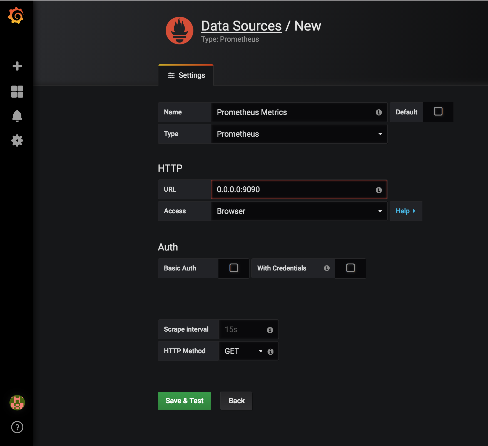
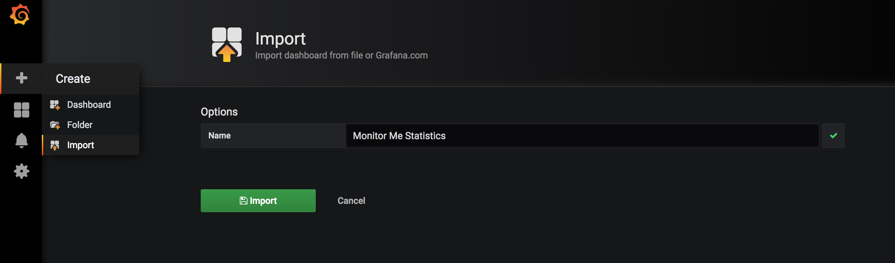

# sdc-prometheus-prototype

This is a small working project aimed at demonstrating a demo app whose
statistics are fed into Prometheus and piped into Grafana for monitoring
and alterting purposes.

## Prerequisites
- [Docker](https://www.docker.com/get-docker)
- A terminal emulator
- [cURL](https://curl.haxx.se/download.html#MacOSX)

## Installing

First clone the repository
```shell
git clone https://github.com/ONSdigital/sdc-prometheus-prototype.git
```

Change directory to the project
```shell
cd sdc-prometheus-prototype/monitor_me
```

In the cloned directory, execute
```shell
docker-compose up
```

## Configuration

Now that you have Prometheus and Grafana up and running, it's time to
configure them to hook up to the demo app!

1. Set up a data source in Grafana



- Use 'Prometheus Metrics' as the name - this will allow importing dashboard configuration to work
- The URL will always be 0.0.0.0:9090 - the port that Prometheus is running on
- Access is via a Browser
- Press Save & Test once finished

2. Importing Grafana Dashboard configuration - select sdc_prometheus_prototype/monitor_me/sample_grafana_dashboard.json



Then click Import

3. And you're done! Now, when you access [Demo App](http://0.0.0.0:5000/) you'll see a
lovely 'Hello World' message, but now if you go back to Grafana you'll
find that the graphs will start updating!
